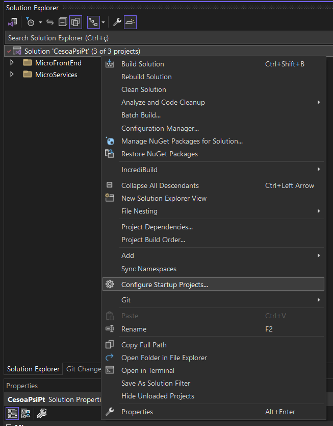
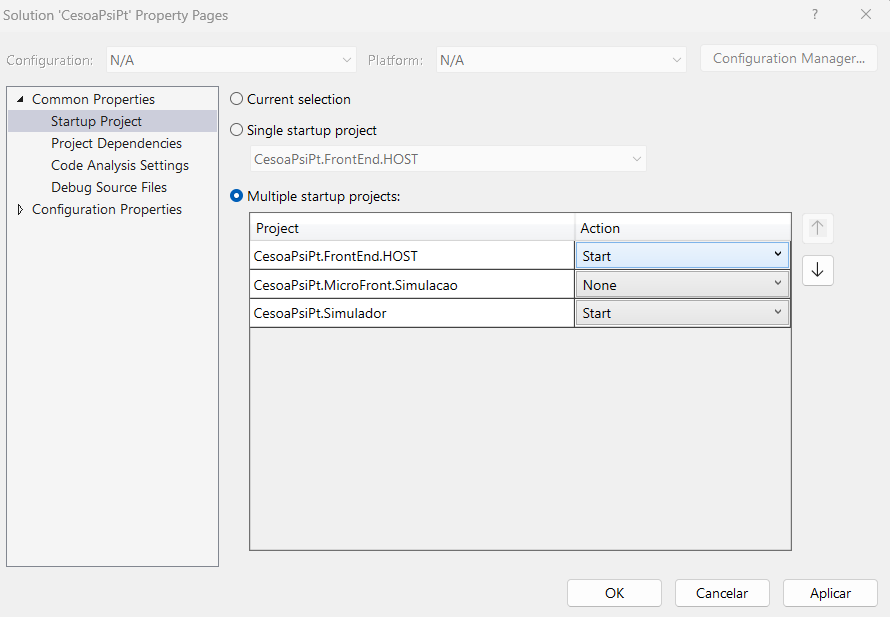
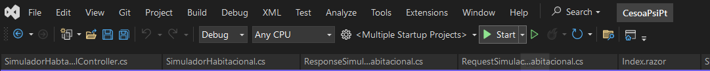

# Instruções para Configuração e Execução do Projeto `CesoaPsiPt`

Este guia descreve como configurar e executar a solução `CesoaPsiPt` no Visual Studio, que envolve múltiplos projetos que precisam ser executados simultaneamente.

## Passo a Passo

### 1. Abrir a Solução

1. Abra o Visual Studio.
2. Navegue até o diretório onde a solução está localizada: `..\PSICESOA\aspnet\CesoaPsiPt\`.
3. Abra o arquivo `CesoaPsiPt.sln`.

### 2. Configurar Múltiplos Projetos de Inicialização

1. Clique com o botão direito do mouse na solução no **Solution Explorer**.
2. Selecione **Configure Startup Projects...**.

### 3. Selecionar Projetos para Inicialização Múltipla

1. Na janela de diálogo **Solution 'CesoaPsiPt' Property Pages**, selecione a opção **Multiple startup projects**.
2. Configure as ações de inicialização:
   - **CesoaPsiPt.FrontEnd.HOST**: Selecione **Start** na coluna **Action**.
   - **CesoaPsiPt.Simulador**: Selecione **Start** na coluna **Action**.
   - **CesoaPsiPt.MicroFront.Simulacao**: Selecione **None** (ou **Start** se necessário).

### 4. Executar a Solução

1. Após configurar os projetos de inicialização, clique em **OK**.
2. Na barra de ferramentas de depuração do Visual Studio, verifique se a configuração de inicialização está definida como **<Multiple Startup Projects>**.
3. Clique no botão **Start** (ou pressione `F5`) para iniciar a solução.

Após seguir esses passos, os projetos configurados serão iniciados simultaneamente, permitindo que você trabalhe com o frontend e o backend de forma integrada.
